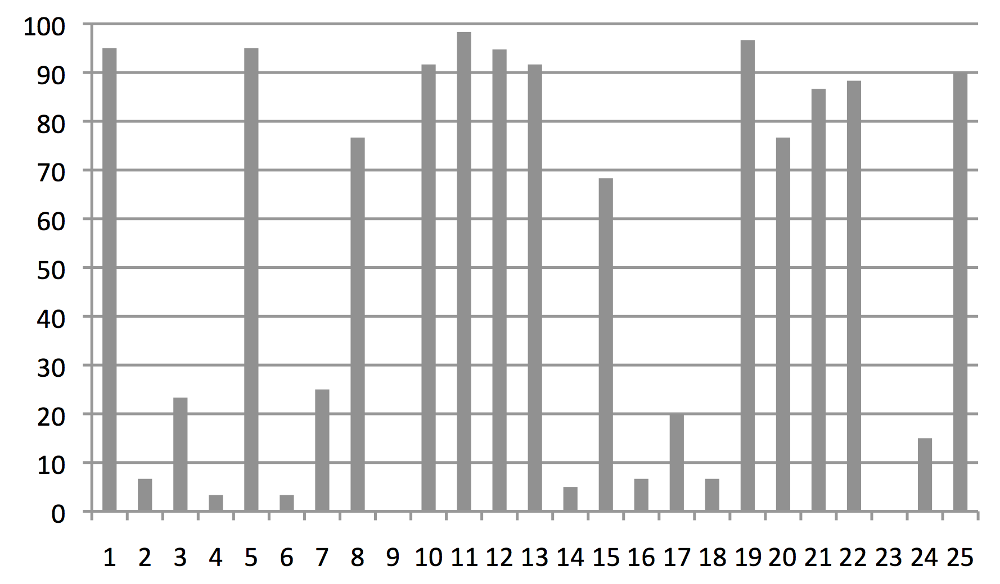

```{r setup, include=FALSE, echo = FALSE, message = FALSE}
knitr::opts_chunk$set(echo=TRUE, warning=FALSE, message=FALSE, dev.args = list(bg = 'transparent'))
require('gtools')
require('combinat')
require('ggplot2')
require('gridExtra')
require('reshape2')
require('coda')
require('ggmcmc')
require('rjags')
require('runjags')
require('dplyr')
require('rstan')
theme_set(theme_grey() + theme(plot.background=element_blank()) )
normalize = function(x){ return(x / sum(x))}
```


<script type="text/x-mathjax-config">
  MathJax.Hub.Config({ TeX: { extensions: ["color.js"] }});
</script>

$$ \definecolor{firebrick}{RGB}{178,34,34} \newcommand{\red}[1]{{\color{firebrick}{#1}}} $$
$$ \definecolor{green}{RGB}{107,142,35} \newcommand{\green}[1]{{\color{green}{#1}}} $$
$$ \definecolor{blue}{RGB}{0,0,205} \newcommand{\blue}[1]{{\color{blue}{#1}}} $$
$$ \newcommand{\den}[1]{[\![#1]\!]} $$
$$ \newcommand{\set}[1]{\{#1\}} $$
$$ \newcommand{\tuple}[1]{\langle#1\rangle} $$

$$\newcommand{\States}{{T}}$$
$$\newcommand{\state}{{t}}$$
$$\newcommand{\Messgs}{{M}}$$
$$\newcommand{\messg}{{m}}$$

## roadmap

<div style = "float:left; width:45%;">

<span style = "color:white"> &nbsp; </span>

language processing

<span style = "color:white"> &nbsp; </span>

levels of analysis

<span style = "color:white"> &nbsp; </span>

rational speech act model
  
</div>
<div style = "float:right; width:45%;">

<span style = "color:white"> &nbsp; </span>

experimental data

<span style = "color:white"> &nbsp; </span>

model fits

<span style = "color:white"> &nbsp; </span>

reflection
  
</div>  


# processing?

## incremental & predicitive processing

<span style = "color:firebrick">processing</span>

- comprehension of serially presented written or oral language input in context

<span style = "color:white"> &nbsp; </span>

<span style = "color:firebrick">incrementality</span>

- build a syntactic & semantic representations as the sentence comes in

    - what's the increment size? fixed or variable?
    
    - how to deal with ambiguity? singular guess or parallel hypotheses?

<span style = "color:white"> &nbsp; </span>

<span style = "color:firebrick">predicitive</span>

- minimal sense: processing behavior is a function of current state

- strong(est) sense: comprehender entertains hypotheses about the future

<div style = "position:absolute; top: 620px; right:60px;">
  (Kuperberg & Jaeger 2016)
</div>

# levels of analysis

## levels of analysis

<span style = "color:white"> &nbsp; </span>

<span style = "color:white"> &nbsp; </span>


<div style = "float:left; width:40%;">
  
</div>
<div style = "float:right; width:50%;">

<div style="text-align: center">

  <span style = "color:white"> &nbsp; </span>

  
  computational
  
  <span style = "color:white"> &nbsp; </span>
  
  algorithmic
  
  <span style = "color:white"> &nbsp; </span>
  
  implementational
  
</div>
  
</div>  


<div style = "position:absolute; top: 620px; right:60px;">
  (Marr 1982)
</div>

## levels of analysis

<div style="text-align: center">

</div>

<div style = "position:absolute; top: 620px; right:60px;">
  (Franke & Jäger 2016)
</div>

## algorithmic-level accounts

<div align = 'center'>
  
</div>

## mechanics of scalar implicature processing

<div style = "float:left; width:45%;">

<span style = "color:firebrick">what?</span>

1. compute SI
2. verify SI 
3. integrate/cancel SI

<span style = "color:white"> &nbsp; </span>

<span style = "color:firebrick">when?</span>

1. scalar item
2. full NP
3. matrix clause

</div>
<div style = "float:right; width:45%;">

<span style = "color:firebrick">how?</span>

1. costly
2. delayed
3. cheap & immediate
  
<span style = "color:white"> &nbsp; </span>

<span style = "color:firebrick">whence?</span>

1. automatic
2. voluntary
3. context-dependent
  
</div>  

## method of choice: hypothesis testing

<span style = "color:white"> &nbsp; </span>

<div style = "float:left; width:45%;">

pick account 

<span style = "color:white"> &nbsp; </span>

derive some (excentric) prediction

<span style = "color:white"> &nbsp; </span>

design experiment

<span style = "color:white"> &nbsp; </span>

refute & repeat
  
</div>
<div style = "float:right; width:45%;">

<div align = 'center'>
  
</div>
  
</div>  

<div style = "position:absolute; top: 620px; right:60px;">
  (Platt 1964)
</div>


## computational-level accounts

<span style = "color:white"> &nbsp; </span>


<div align = 'center'>
  
</div>

## notions of "explanation"

<span style = "color:white"> &nbsp; </span>

<span style = "color:white"> &nbsp; </span>

<div style="text-align: center">
<span style = "color:firebrick">description</span>  <-----------------------------------------------> <span style = "color:firebrick">reason</span>
</div>

<span style = "color:white"> &nbsp; </span>

<span style = "color:white"> &nbsp; </span>

<span style = "color:white"> &nbsp; </span>

<div style = "float:left; width:55%;">
  
  <span style = "color:firebrick">diagnostics</span>
  
  how would it work on Tralfamadore?
  
  could you conceive of it without seeing any data?
</div>
<div style = "float:right; width:40%;">

<div align = 'center'>
  
</div>
  
</div>  


## method of choice: models & comparison


<div style = "float:left; width:45%;">
  
<span style = "color:firebrick">data-generating models</span>  


  
</div>
<div style = "float:right; width:45%;">

<span style = "color:firebrick">statistical model comparison</span>


  
</div>  

## expectation-based processing accounts

- basic premisse: anticipation is an advantage
- (maximally) predictive interpreter has <span style = "color:firebrick">lexico-syntactic expecations</span> $P(w_1, \dots, w_n \mid c)$
    - operationalized by corpus frequencies of relevant structures
    - possible beam-search approximation
    - derived expectation about continuation $P(w_{i+1}, \dots, w_n \mid w_1, \dots, w_i, c)$

<span style = "color:white"> &nbsp; </span>
    
- <span style = "color:firebrick">processing difficulty</span> linked to distance between $P(\cdot \mid  w_1, \dots, w_\red{i}, c)$ and  $P(\cdot \mid w_1, \dots, w_\red{i+1}, c)$
    - self-paced reading times (Smith & Levy 2013)
    - various ERP components, notably N400 amplitude (Frank et al. 2015)

<div style = "position:absolute; top: 620px; right:60px;">
  (e.g., Jurafsky 1996, Hale 2006, Levy 2008)
</div>

# rational pragmatic processors

## rational speech act model

<span style = "color:white"> &nbsp; </span>

<span style = "color:firebrick">literal listener</span> picks literal interpretation (uniformly at random):

$$ P_{LL}(t \mid m) \propto P(t \mid [\![m]\!]) $$

<span style = "color:white"> &nbsp; </span>

<span style = "color:firebrick">Gricean speaker</span> approximates informativity-maximization:

$$ P_{S}(m \mid t) \propto \exp( \lambda P_{LL}(t \mid m)) $$

<span style = "color:white"> &nbsp; </span>

<span style = "color:firebrick">pragmatic listener</span> uses Bayes' rule to infer likely world states:

$$ P_L(t \mid m ) \propto P(t) \cdot P_S(m \mid t) $$

<span style = "color:white"> &nbsp; </span>

interpretation as <span style = "color:firebrick">holistic</span>: full & complete utterance

<div style = "position:absolute; top: 620px; right:60px;">
  (e.g., Benz 2006, Frank & Goodman 2012)
</div>


## incremental & predicitive interpretation

- messages are word sequences: $\messg = w_1, \dots, w_n$

- initial subsequence of $\messg$: $\messg_{\rightarrow i} = w_1, \dots w_i$

- all messages sharing initial subsequence: $\Messgs(\messg_{\rightarrow i}) = \set{\messg' \in \Messgs \mid \messg'_{\rightarrow i} =
  \messg_{\rightarrow i}}$

- <span style = "color:firebrick">next-word expectation</span>:

$$P_L(w_{i+1} \mid \messg_{\rightarrow i}) \propto \sum_{\state} P(\state) \ \sum_{\messg' \in
    \Messgs(\messg_{\rightarrow i}, w_{i+1})} P_S(\messg' \mid \state)$$

- <span style = "color:firebrick">interpretation evidence</span>:

$$P_L(\state \mid \messg_{\rightarrow i}) \propto P(\state) \ \sum_{\messg' \in
    \Messgs(\messg_{\rightarrow i})} P_S(\messg' \mid \state)$$

## empirical measures

<div style = "float:left; width:45%;">
  
  <span style = "color:firebrick">next-word</span>
  
  - self-paced reading
  
  - eye-tracked reading
  
  - ERPs
  
  - ...?
  
</div>
<div style = "float:right; width:45%;">
  
  <span style = "color:firebrick">interpretation</span>
  
  - visual worlds
  
  - mouse-tracking
  
  - ...?
  
  
</div>  

# ERP traces of scalar implicature

## some EEG studies on <span style = "font-style: italic">some</span>

<div style = "float:left; width:45%;">

<span style = "color:firebrick">Noveck & Posada (2003)</span> 

- ERPs on last word during reading: e.g. "Some people have fins/lungs/pets."
- N400 amplitude: "pets" > "lungs"

<span style = "color:white"> &nbsp; </span>

<span style = "color:firebrick">Nieuwland et al. (2010)</span>

- similar to Noveck & Posada
- two types of responders based on Autism Spectrum Quotient
    - low ASQ: "lungs" > "pets" ; high ASQ: "lungs" $\approx$ "pets"
  
</div>
<div style = "float:right; width:45%;">

<span style = "color:firebrick">Hunt et al. (2013)</span>

- sentences with pictorial contexts: controls for lexical associations
- truth-value judgement after each sentence
- <span style = "color:firebrick">semantic vs. pragmatic responders</span>
- pragmatic resonders' N400: false > underinformative > true & felicitous

<span style = "color:white"> &nbsp; </span>

<span style = "color:firebrick">Spychalska et al. (2016)</span>

- similar to Hunt, but more careful design
- no explanatory role for ASQ scores
- strong explanatory role for responder type
- explicit focus on <span style = "color:firebrick">next-work prediction</span>
  
</div>  


    

    
## experiment 1

<span style = "color:firebrick">participants & procedure</span>

- EEG recording of 25 native German speakers
- picture (1500ms) -> sentence (500ms per word) -> truth-value judgement

<span style = "color:firebrick"> sentence material </span>

- "Alle/Einige$_1$ Punkte sind blau$_2$, die im Kreis/Quadrat$_3$ sind"
- "All/some of the dots in the circle/square are blue/red"

<span style = "color:firebrick">visual stimuli</span>

<div align = 'center'>
  
</div>


## computational-level rational processing

<span style = "color:firebrick">general assumptions</span>

- listener expects speaker to make a pragmatically felicitous utterance
- listener does not give up on speaker rationality on the way (charity, forward induction, ...)

<span style = "color:white"> &nbsp; </span>

<span style = "color:firebrick">experimental microcosmos assumption</span>

- possible meanings $\States$: pairs of contexts ($A$ - $D$) and speaker-intended shape
- possible messages $\Messgs$: "All/some dots are blue/red that are in the square/circle."

<span style = "color:white"> &nbsp; </span>

<span style = "color:firebrick">specific assumptions</span>

- listener knows context, but not shape
- speaker chooses description for context and shape

## next-word expectations vs. N400

- incremental RSA predicts $P_L(w_{i+1} \mid w_{1,\dots,i}, c)$
- correlating predicted next-word expectations grand-average early N400 (300-400ms):
    - $r= 0.44$, $p < 0.01$ in total
    - $r = 0.81$, $p < 0.001$ after exclusion of unexpected continuations


<div align = 'center'>
  
</div>

## closer look: quantifier position

<div style = "float:left; width:35%;">
  


</div>
<div style = "float:right; width:55%;">


</div>  

## closer look: adjective position

<div style = "float:left; width:35%;">
  


</div>
<div style = "float:right; width:55%;">


</div>  

## closer look: shape noun position

<div style = "float:left; width:35%;">
  


</div>
<div style = "float:right; width:55%;">


</div>  

# semantic vs. pragmatic responders

## semantic vs. pragmatic responders

<div align = 'center'>
  
  
  percentage of pragmatic responses per participant
</div>

## predictions for response types

<span style = "color:white"> &nbsp; </span>

<span style = "color:firebrick">pragmatic responders</span>

expect <span style = "color:firebrick">pragmatic speakers</span>

$$P(\text{more informative true}) > P(\text{less informative true}) > P(\text{false})$$


<span style = "color:white"> &nbsp; </span>

<span style = "color:firebrick">semantic responders</span>

expect <span style = "color:firebrick">literal speakers</span>

$$P(\text{more informative true}) = P(\text{less informative true}) > P(\text{false})$$

    
<div style = "position:absolute; top: 620px; right:60px;">
  (Franke 2012, Franke & Degen 2016)
</div>

## results 

- correlation between predictions and observation (excluding redundant relative clauses):
    - $r= 0.69$, $p < 0.01$ for pragmatic responders
    - $r = 0.57$, $p < 0.01$ for semantic responders

<div style = "float:left; width:35%;">
  


</div>
<div style = "float:right; width:55%;">


</div> 

# further issues

## experimental microcosmos

<span style = "color:firebrick">main issue</span>

how to fix reasonable $\States$ and $\Messgs$?


<span style = "color:white"> &nbsp; </span>


<span style = "color:firebrick">experimental microcosmos assumption</span>

all (and only?) meanings and forms that occur in the experiment

<span style = "color:white"> &nbsp; </span>

<span style = "color:firebrick">prediction</span>

massive influence of filler material

## experiment 2

<span style = "color:firebrick">participants & procedure</span>

- EEG recording of 24 native German speakers
- picture (1500ms) -> sentence (500ms per word) -> truth-value judgement

<span style = "color:firebrick"> sentence material </span>

- "Einige$_1$ Punkte sind blau$_2$, die im Kreis/Quadrat$_3$ sind"
- "Einige$_1$ Punkte sind blau$_2$"

<span style = "color:firebrick">visual stimuli</span>

<div align = 'center'>
  
</div>


## results

<span style = "color:firebrick">behavioral data</span>

only one participant consistently gave pragmatic judgements

<span style = "color:firebrick">ERP responses</span>

no trace of pragmatic infelicity / expectations

# conclusions

## conclusions

- incremental RSA seems feasible:
    - next-word expecations & accummulated interpretation evidence
    - genuine pragmatic expectations beyond / on top of lexico-pragmatic expectations

<span style = "color:white"> &nbsp; </span>
    
- main challenges:
    - link functions for interesting experimental measures
    - how to fix $\States$ and $\Messgs$ in general?
    - how to scale up to more open-ended applications? tradeoff lexico-syntactic vs. pragmatic expectations?

# appendix

## quantifier

<div align = 'center'>
  
</div>

## adjective

<div align = 'center'>
  
</div>

## noun

<div align = 'center'>
  
</div>

